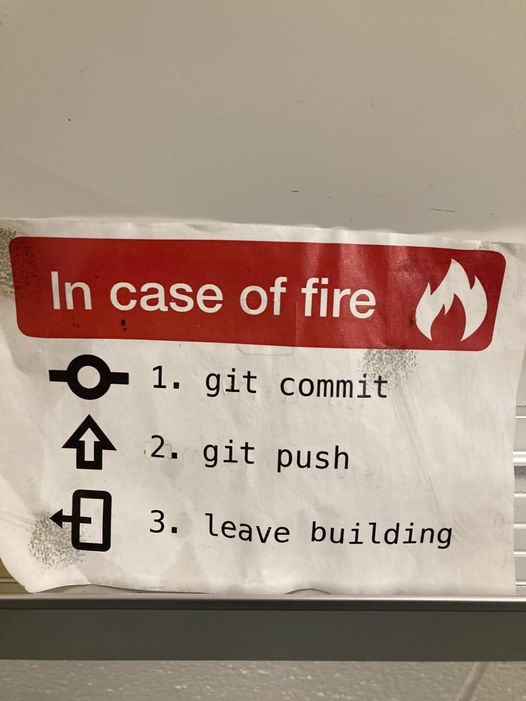

# Git for the Sysadmin

## In Case Of Fire...
Yell "FIRE!"
Barrel Roll
Holler "Freebird!"

## Installation and Download Links
1. [VSCode](https://code.visualstudio.com)
1. [Git](https://git-scm.com/download)
1. [GitHub Desktop](https://desktop.github.com)

## Cheat/Reference Sheets
* [Git Cheat Sheet](https://education.github.com/git-cheat-sheet-education.pdf)
* [Github Flavored Markdown Cheat Sheet](https://enterprise.github.com/downloads/en/markdown-cheatsheet.pdf)

## GitHub Pages Sites and Source Repositories
* [MMS MOA Demo Site](https://moa2024github.zaske.dev/)
* [MMS MOA Demo Site Source/Repo](https://github.com/zaskem/mms-moa-2024-ghpages-demo)
* [Monty Python Script Repository Site](https://python.mzonline.com)
* [Monty Python Script Repository Site Source/Repo](https://github.com/zaskem/montypython-repository)
